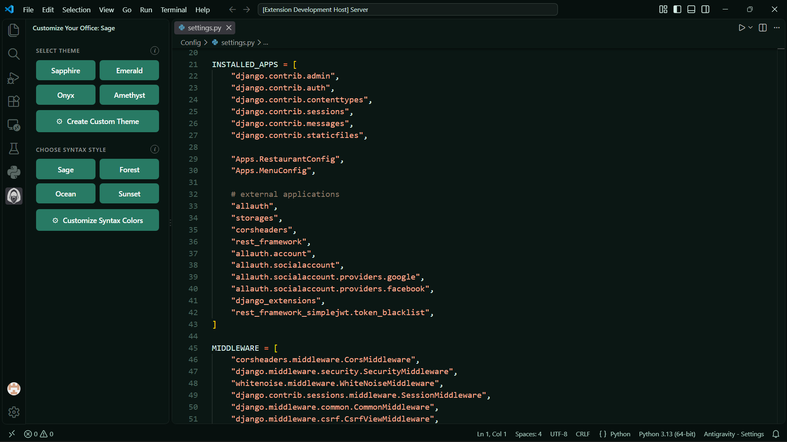
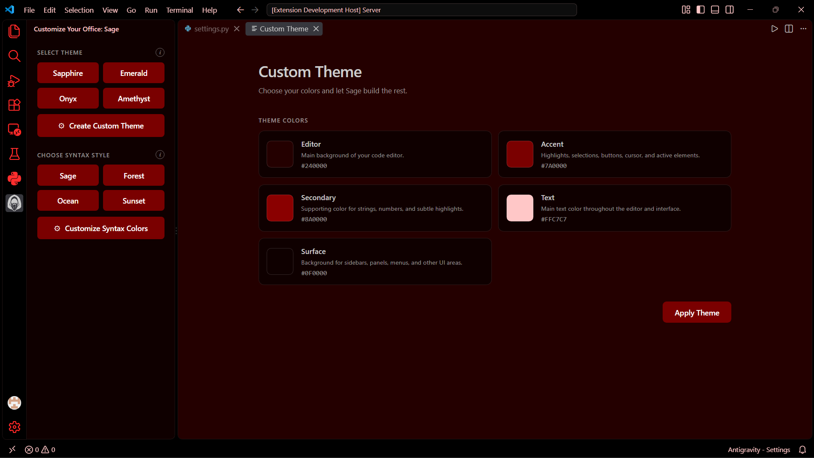
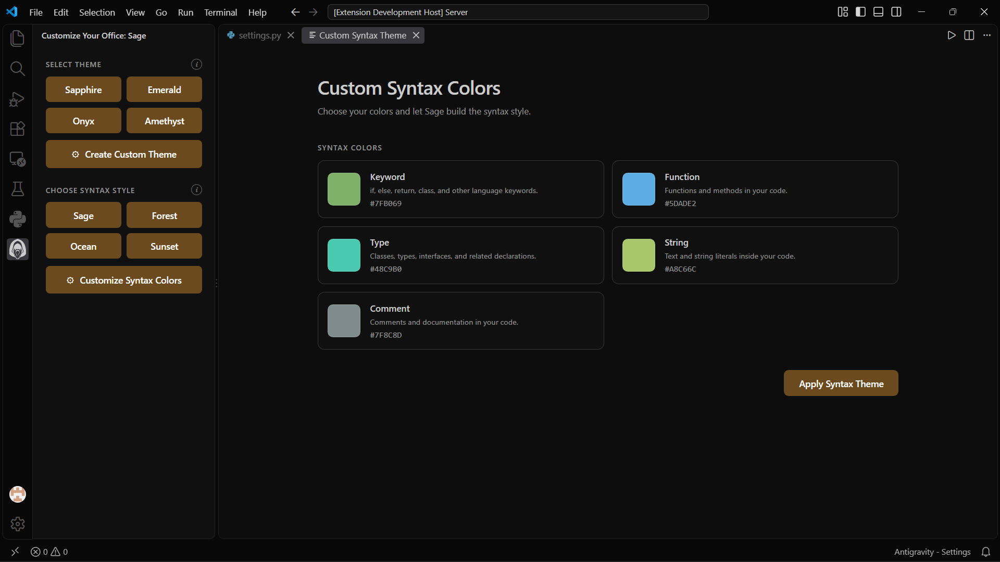
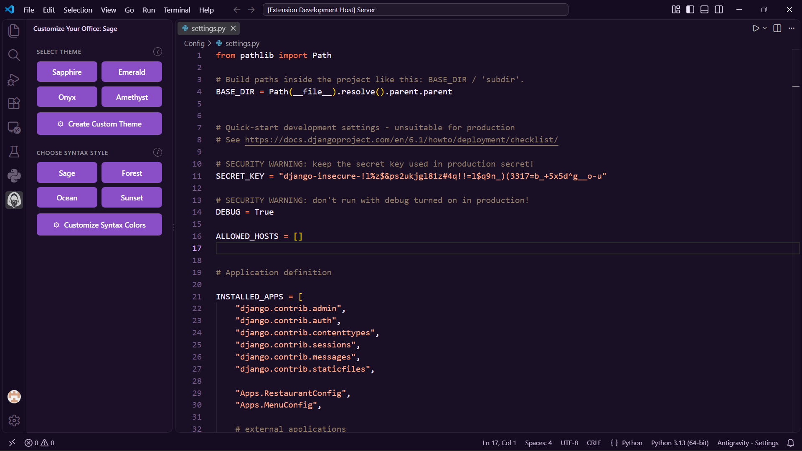

# Sage

Sage is a lightweight VS Code extension for workspace customization.

It brings themes, syntax customization, and workspace appearance controls into a single interface, allowing you to personalize your VS Code environment without having to manually edit multiple configuration files.

## Features

### Theme Customization

Sage provides a collection of built-in themes designed to give your workspace a different visual appearance.

You can switch between the available themes directly from the Sage interface.



Additional themes can be added and improved over time as Sage develops.

### Custom Themes

Sage includes a custom theme editor that allows you to create your own VS Code color configuration.

Instead of manually searching through VS Code's theme settings, you can use Sage's interface to customize the visual elements of your editor.



Your custom theme can be applied directly from Sage and used as your active VS Code theme.

### Syntax Customization

Sage also provides syntax customization, giving you control over how different elements of your source code are displayed.

The custom syntax editor allows you to configure syntax colors and create a coding environment that matches your preferred style.



Built-in syntax configurations are also included so you can switch between different syntax styles without creating one from scratch.



### Workspace Customization

Sage is designed to keep workspace customization in one place.

The extension provides a dedicated Sage interface in the VS Code Activity Bar, making its customization features accessible without requiring users to navigate through VS Code's settings and configuration files.

## Interface

Sage adds its own section to the VS Code Activity Bar.

From there, users can access the available customization tools and apply changes to their workspace.


## Installation

Sage can be installed directly from the Visual Studio Code Marketplace.

1. Open Visual Studio Code.
2. Open the Extensions view.
3. Search for `Sage`.
4. Select the Sage extension.
5. Click **Install**.
6. Open Sage from the Activity Bar.

## Usage

After installing Sage, open the Sage panel from the VS Code Activity Bar.

From the panel you can access the available customization options, including:

* Built-in themes
* Custom theme configuration
* Built-in syntax configurations
* Custom syntax configuration
* Workspace appearance controls

Changes can be applied directly to your VS Code environment.

## Built-in Themes

Sage currently includes multiple built-in themes:

* Sapphire
* Emerland
* Onyx
* Amethyst
* Sage Custom

The available themes may change as new versions of Sage are released.

## Built-in Syntax Themes

Sage currently includes multiple syntax configurations:

* Sage
* Forest
* Ocean
* Sunset
* Custom Syntax

These provide different syntax styles that can be selected through the Sage interface.

## Requirements

* Visual Studio Code `1.136.0` or newer.

## Development

Sage is open source and developed using TypeScript and the VS Code Extension API.

### Clone the repository

```bash
git clone https://github.com/Xero84330/Sage.git
cd Sage
```

### Install dependencies

```bash
npm install
```

### Compile

```bash
npm run compile
```

### Run the extension

Open the project in VS Code and press `F5` to launch the Extension Development Host.

## Contributing
## Contributing

Sage is an open source project developed and maintained by Saket Singh.

Contributions, bug reports, feature suggestions, and improvements are welcome.

If you find a problem or have an idea for Sage, please open an issue or submit a pull request on the GitHub repository.

Repository:

https://github.com/Xero84330/Sage

## Roadmap

Sage is an actively developing project. Future releases may expand the available customization options, themes, syntax controls, and workspace features.

The goal is to keep Sage lightweight while providing useful customization without making the VS Code environment unnecessarily complicated.

## License

Sage is released under the MIT License.

See [LICENSE](LICENSE) for the full license text.
